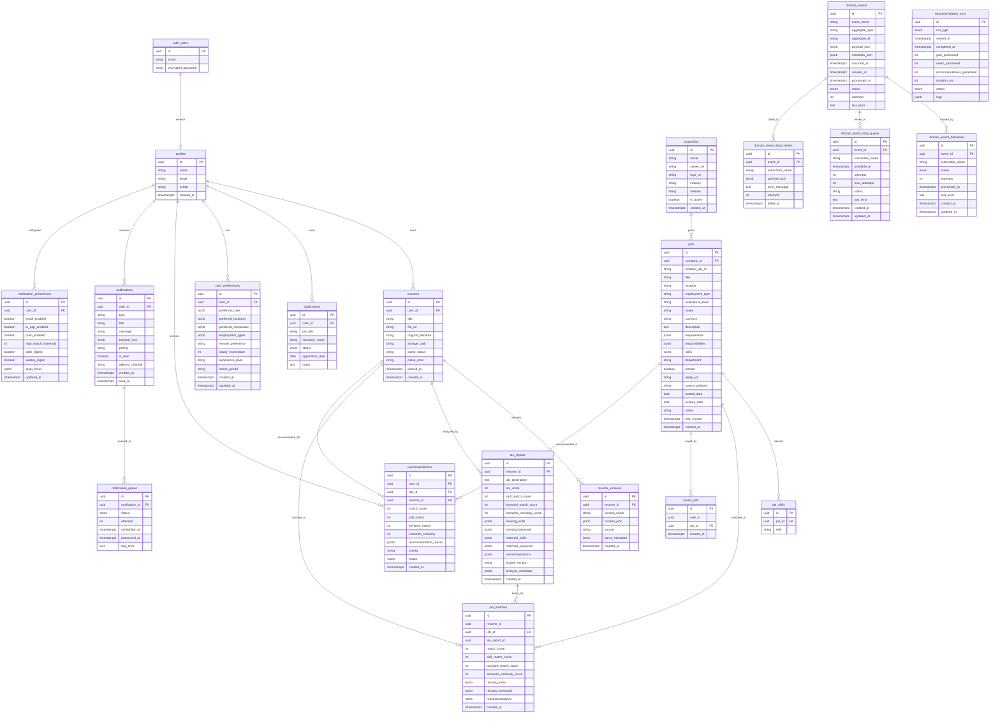

# System Architecture — CareerOS

**AI Career Operating System**

> This document is the master technical reference for the CareerOS backend. It describes the architecture, module responsibilities, data flow, event-driven infrastructure, and deployment model. It is intended for onboarding new developers and providing context for AI coding agents.

---

## Table of Contents

1. [Executive Summary](#1-executive-summary)
2. [High-Level Architecture](#2-high-level-architecture)
3. [Project Folder Structure](#3-project-folder-structure)
4. [Layered Architecture](#4-layered-architecture)
5. [Module Breakdown](#5-module-breakdown)
6. [Request Flow](#6-request-flow)
7. [Database Architecture](#7-database-architecture)
8. [Repository Pattern](#8-repository-pattern)
9. [Service Layer](#9-service-layer)
10. [Event Bus](#10-event-bus)
11. [Background Workers](#11-background-workers)
12. [ATS Engine](#12-ats-engine)
13. [Job Intelligence Platform](#13-job-intelligence-platform)
14. [Recommendation Engine](#14-recommendation-engine)
15. [Notification Engine](#15-notification-engine)
16. [Security](#16-security)
17. [API Inventory](#17-api-inventory)
18. [Environment Variables](#18-environment-variables)
19. [Testing Strategy](#19-testing-strategy)
20. [Deployment Architecture](#20-deployment-architecture)
21. [Scalability](#21-scalability)
22. [Future Architecture](#22-future-architecture)

---

## 1. Executive Summary

CareerOS is an **AI Career Operating System** — a full-stack, event-driven platform that manages the entire job-seeking lifecycle. It combines resume management, ATS (Applicant Tracking System) analysis, resume optimization, job intelligence, recommendation generation, notification delivery, and application tracking into a single cohesive system.

### Architectural Philosophy

- **Event-Driven Core**: All service communication flows through a persistent publish-subscribe event bus. This ensures loose coupling, reliable delivery, and full auditability.
- **Layered Separation**: The system is organized into strict layers — Presentation, API, Actions, Services, Repositories, Persistence — each with a single responsibility.
- **Dual-Engine ATS**: A Python NLP microservice (spaCy + sentence-transformers) provides deep semantic analysis, with a TypeScript heuristic fallback for resilience.
- **Modular Ingestion**: Job crawling uses a pluggable adapter pattern — each ATS platform (Workday, Greenhouse, Lever, etc.) has its own adapter implementing a common interface.
- **Preference-Aware Recommendations**: The recommendation engine blends ATS match scores with user preference profiles using configurable weighting factors.

### System Boundaries

| Boundary | Technology |
|---|---|
| Frontend | Next.js 16 App Router, React 19, Tailwind CSS 4 |
| API Layer | Next.js API Routes + Server Actions |
| Service Layer | TypeScript classes with dependency injection |
| Database | Supabase (PostgreSQL 15+) |
| Auth | Supabase Auth (email/password, Google OAuth) |
| Storage | Supabase Storage (resumes, avatars) |
| NLP Engine | Python 3 + FastAPI + spaCy + sentence-transformers |
| Test Runner | Node.js built-in test runner |

---

## 2. High-Level Architecture

```
┌──────────────────────────────────────────────────────────────────────────┐
│                            CLIENT LAYER                                   │
│                                                                          │
│  ┌─────────────┐  ┌─────────────┐  ┌─────────────┐  ┌───────────────┐  │
│  │  Browser    │  │  Mobile     │  │  API Client │  │  Admin Panel  │  │
│  └──────┬──────┘  └──────┬──────┘  └──────┬──────┘  └───────┬───────┘  │
└─────────┼────────────────┼────────────────┼──────────────────┼──────────┘
          │                │                │                  │
          ▼                ▼                ▼                  ▼
┌──────────────────────────────────────────────────────────────────────────┐
│                         NEXT.JS 16 APP ROUTER                            │
│                                                                          │
│  ┌──────────────────────────────────────────────────────────────────┐   │
│  │                    REQUEST HANDLERS                                │   │
│  │  ┌──────────────┐  ┌──────────────┐  ┌──────────────────────┐   │   │
│  │  │  API Routes  │  │  Server      │  │  React Server        │   │   │
│  │  │  (REST)      │  │  Actions     │  │  Components (RSC)    │   │   │
│  │  └──────┬───────┘  └──────┬───────┘  └──────────────────────┘   │   │
│  └─────────┼─────────────────┼──────────────────────────────────────┘   │
└────────────┼─────────────────┼──────────────────────────────────────────┘
             │                 │
             ▼                 ▼
┌──────────────────────────────────────────────────────────────────────────┐
│                         SERVICE LAYER                                    │
│                                                                          │
│  ┌──────────┐  ┌──────────┐  ┌──────────┐  ┌──────────┐  ┌──────────┐  │
│  │   ATS    │  │   Jobs   │  │  Notif.  │  │  Recs.   │  │Optimizer │  │
│  │ Service  │  │ Service  │  │  Engine  │  │  Engine  │  │ Service  │  │
│  └──────────┘  └──────────┘  └──────────┘  └──────────┘  └──────────┘  │
│  ┌──────────┐  ┌──────────┐  ┌──────────┐  ┌──────────┐               │
│  │Crawlers  │  │ Resume   │  │  Event   │  │  Auth    │               │
│  │Pipeline  │  │ Parsing  │  │  Bus     │  │  Service │               │
│  └──────────┘  └──────────┘  └──────────┘  └──────────┘               │
└──────────────────────┬──────────────────────────────────────────────────┘
                       │
                       ▼
┌──────────────────────────────────────────────────────────────────────────┐
│                       REPOSITORY LAYER                                   │
│                                                                          │
│  ┌──────────────┐  ┌──────────────┐  ┌──────────────┐  ┌────────────┐  │
│  │  ATSReport   │  │  Job         │  │  Recomm.     │  │  Notif.    │  │
│  │  Repository  │  │  Repository  │  │  Repository  │  │  Repository│  │
│  └──────────────┘  └──────────────┘  └──────────────┘  └────────────┘  │
│  ┌──────────────┐  ┌──────────────┐  ┌──────────────┐                  │
│  │  EventStore  │  │  ResumeParse │  │  UserPref.   │                  │
│  │              │  │  Repository  │  │  Repository  │                  │
│  └──────────────┘  └──────────────┘  └──────────────┘                  │
└──────────────────────┬──────────────────────────────────────────────────┘
                       │
                       ▼
┌──────────────────────────────────────────────────────────────────────────┐
│                       PERSISTENCE LAYER                                  │
│                                                                          │
│  ┌──────────────────────────────────────────────────────────────────┐   │
│  │                     SUPABASE (PostgreSQL 15+)                     │   │
│  │                                                                  │   │
│  │  ┌──────────┐ ┌──────────┐ ┌──────────┐ ┌──────────┐ ┌──────┐  │   │
│  │  │ profiles │ │ resumes  │ │ versions │ │ ats_rept │ │ apps │  │   │
│  │  ├──────────┤ ├──────────┤ ├──────────┤ ├──────────┤ ├──────┤  │   │
│  │  │ jobs     │ │ companies│ │ recs     │ │ notifs   │ │queue │  │   │
│  │  ├──────────┤ ├──────────┤ ├──────────┤ ├──────────┤ ├──────┤  │   │
│  │  │ events   │ │ deliveries││ retry_q  │ │ dead_ltr │ │prefs │  │   │
│  │  └──────────┘ └──────────┘ └──────────┘ └──────────┘ └──────┘  │   │
│  └──────────────────────────────────────────────────────────────────┘   │
│                                                                          │
│  ┌──────────────────────────────────────────────────────────────────┐   │
│  │                     SUPABASE STORAGE                              │   │
│  │  ┌──────────────┐  ┌──────────────┐                              │   │
│  │  │  resumes/    │  │  avatars/    │                              │   │
│  │  │  (private)   │  │  (public)    │                              │   │
│  │  └──────────────┘  └──────────────┘                              │   │
│  └──────────────────────────────────────────────────────────────────┘   │
└──────────────────────┬──────────────────────────────────────────────────┘
                       │
                       ▼
┌──────────────────────────────────────────────────────────────────────────┐
│                    EXTERNAL MICROSERVICES                                 │
│                                                                          │
│  ┌──────────────────────────────────────────────────────────────────┐   │
│  │              PYTHON ATS ENGINE V1 (FastAPI)                      │   │
│  │                                                                  │   │
│  │  ┌──────────────────────┐  ┌────────────────────────────────┐   │   │
│  │  │  spaCy en_core_web_sm│  │  sentence-transformers         │   │   │
│  │  │  (keyword extraction)│  │  all-MiniLM-L6-v2              │   │   │
│  │  │  (skill extraction)  │  │  (semantic similarity)         │   │   │
│  │  └──────────────────────┘  └────────────────────────────────┘   │   │
│  └──────────────────────────────────────────────────────────────────┘   │
│                                                                          │
│  ┌──────────────────────────────────────────────────────────────────┐   │
│  │              COMPANY CAREER PAGES (HTTP)                         │   │
│  │  Workday | Greenhouse | Lever | Ashby | SmartRecruiters | iCIMS │   │
│  └──────────────────────────────────────────────────────────────────┘   │
└──────────────────────────────────────────────────────────────────────────┘
```

### Data Flow Summary

```
User Action → Server Action / API Route → Service → Repository → Supabase
                                                          │
                                                     Event Bus
                                                          │
                                              ┌───────────┴───────────┐
                                              ▼                       ▼
                                     Notification Subscriber    Other Subscribers
                                              │
                                              ▼
                                     Notification Engine
                                              │
                                              ▼
                                     Notification Queue → Dispatch
```

---

## 3. Project Folder Structure

```
resume-pilot/
│
├── actions/                          # Next.js Server Actions (mutation layer)
│   ├── applications.ts               #   CRUD for job applications
│   ├── ats.ts                        #   Run ATS analysis with persistence
│   ├── auth.ts                       #   Sign in, sign up, OAuth, password reset
│   ├── jobs.ts                       #   Search, save, unsave jobs
│   ├── notifications.ts              #   List, mark read, update preferences
│   ├── optimizer.ts                  #   Generate suggestions, accept, recalculate ATS
│   ├── parse-resume.ts               #   Re-parse a stored resume from storage
│   ├── profile.ts                    #   Update profile name/avatar and password
│   ├── recommendations.ts            #   List, refresh, dismiss, save recommendations
│   └── resumes.ts                    #   Create resume, save version, create version, delete
│
├── app/                              # Next.js App Router
│   ├── (auth)/                       #   Auth pages (login, signup, forgot-password)
│   ├── (marketing)/                  #   Marketing/landing pages
│   ├── api/                          #   RESTful API Routes
│   │   ├── admin/
│   │   │   ├── crawlers/             #     POST - Trigger crawler runs
│   │   │   └── sync/                 #     POST - Trigger sync operations
│   │   ├── ats/analyze/              #     POST - Run ATS analysis
│   │   ├── jobs/                     #     GET - Search jobs
│   │   │   ├── [id]/                 #     GET - Job details
│   │   │   ├── match/                #     POST - Match resume to job
│   │   │   ├── save/                 #     POST - Save job
│   │   │   ├── saved/                #     GET - List saved jobs
│   │   │   └── search/               #     GET - Search jobs
│   │   ├── notification-preferences/ #     GET/POST - Notification preferences
│   │   ├── notifications/            #     GET - List notifications
│   │   │   ├── read/                 #     POST - Mark one as read
│   │   │   └── read-all/             #     POST - Mark all as read
│   │   ├── optimizer/[resumeId]/     #     POST - Suggestions, accept, recalculate
│   │   ├── recommendations/          #     GET - List recommendations
│   │   │   ├── dismiss/              #     POST - Dismiss recommendation
│   │   │   ├── refresh/              #     POST - Refresh recommendations
│   │   │   ├── save/                 #     POST - Save recommendation
│   │   │   └── top/                  #     GET - Top recommendations
│   │   ├── resumes/[id]/parse/       #     POST - Parse resume
│   │   └── upload/resume/            #     POST - Upload resume file
│   ├── auth/                         #   Auth callback pages
│   ├── dashboard/                    #   Protected dashboard pages
│   ├── favicon.ico
│   ├── globals.css
│   └── layout.tsx                    #   Root layout with providers
│
├── ats-engine/                       # Python ATS Engine V1 (FastAPI microservice)
│   ├── app/
│   │   ├── __init__.py
│   │   ├── main.py                   #   FastAPI entry point (health, analyze, extract-keywords)
│   │   └── engine_v1.py              #   spaCy + sentence-transformers scoring logic
│   ├── requirements.txt              #   Python dependencies
│   └── README.md                     #   Engine documentation
│
├── components/                       # Shared React components
│   ├── ats/                          #   ATS analysis UI components
│   ├── layout/                       #   Layout components (sidebar, header, navigation)
│   ├── resume/                       #   Resume builder components
│   ├── ui/                           #   UI primitives (Radix-based: button, dialog, tooltip, etc.)
│   └── providers.tsx                 #   Client-side providers (QueryClient, Theme, Tooltip)
│
├── docs/                             # Internal documentation
│   ├── event-bus.md                  #   Event bus architecture reference
│   ├── notification-engine.md        #   Notification engine reference
│   └── recommendation-engine.md      #   Recommendation engine reference
│
├── features/                         # Feature-specific page components
│   ├── applications/components/      #   Application tracking UI
│   ├── ats/components/               #   ATS analysis feature UI
│   ├── auth/components/              #   Authentication UI
│   ├── builder/components/           #   Resume builder feature UI
│   ├── optimizer/components/         #   Resume optimizer feature UI
│   ├── profile/components/           #   Profile management UI
│   ├── resumes/components/           #   Resume list UI
│   └── settings/components/          #   Settings UI
│
├── hooks/                            # Custom React hooks
│   ├── useOptimizer.ts               #   TanStack Query mutations for optimizer
│   ├── useResumeParse.ts             #   TanStack Query mutation for resume parsing
│   └── useResumes.ts                 #   TanStack Query for resume list
│
├── lib/                              # Shared utilities and configurations
│   ├── supabase/
│   │   ├── client.ts                 #   Browser-side Supabase client
│   │   ├── server.ts                 #   Server-side Supabase client (cookie-based)
│   │   └── middleware.ts             #   Supabase SSR session middleware
│   ├── validations/
│   │   ├── job.ts                    #   Zod schema for job search
│   │   ├── parse.ts                  #   Zod schema for parse requests
│   │   └── resume.ts                 #   Zod schema for resume operations
│   ├── constants.ts                  #   App-wide constants (bucket names, statuses, sections)
│   ├── resume-content.ts             #   Resume content helpers (plain text, find section, clone)
│   ├── resume-for-ats.ts             #   Resolve resume text for ATS analysis
│   ├── resume-text.ts                #   Deprecated re-export of resume-content
│   └── utils.ts                      #   Utility functions (cn, formatDate, clamp)
│
├── services/                         # Backend service layer (core business logic)
│   ├── ats/
│   │   ├── index.ts                  #   Public exports
│   │   ├── ATSService.ts             #   Unified ATS facade with NLP + fallback
│   │   ├── ATSAnalyzerService.ts     #   Heuristic keyword/skill extraction and scoring
│   │   ├── ATSEngineClient.ts        #   HTTP client for Python ATS Engine
│   │   └── ATSReportRepository.ts    #   Persists ATS reports to Supabase
│   ├── crawlers/
│   │   ├── BaseCrawler.ts            #   Abstract crawler interface
│   │   ├── CompanyAdapterFactory.ts  #   Factory selecting adapter by ATS platform
│   │   ├── JobPipeline.ts            #   Normalization, dedup, storage, event emission
│   │   └── adapters/                 #   Company-specific adapters
│   │       ├── GenericAdapter.ts     #     Fallback adapter
│   │       ├── WorkdayAdapter.ts     #     Workday career pages
│   │       ├── GreenhouseAdapter.ts  #     Greenhouse career pages
│   │       ├── LeverAdapter.ts       #     Lever career pages
│   │       ├── AshbyAdapter.ts       #     Ashby career pages
│   │       ├── SmartRecruitersAdapter.ts  # SmartRecruiters career pages
│   │       └── ICIMSAdapter.ts       #     iCIMS career pages
│   ├── events/
│   │   ├── index.ts                  #   Public exports
│   │   ├── runtime.ts                #   Factory functions for event bus creation
│   │   ├── EventBus.ts               #   EventBus interface definition
│   │   ├── DomainEventBus.ts         #   Concrete EventBus implementation
│   │   ├── EventPublisher.ts         #   Convenience wrapper (auto-ID, timestamp)
│   │   ├── EventRegistry.ts          #   Subscriber registration and lookup
│   │   ├── EventDispatcher.ts        #   Event delivery with retry and DLQ
│   │   ├── EventStore.ts             #   Persistence layer for events
│   │   ├── EventSubscriber.ts        #   Subscriber interface
│   │   ├── RetryQueue.ts             #   Retry logic with exponential backoff
│   │   ├── StructuredLogger.ts       #   Structured logging utility
│   │   └── subscribers/
│   │       └── NotificationEventSubscriber.ts  # Creates notifications from events
│   ├── jobs/
│   │   ├── JobSearchService.ts       #   Filtered job search with pagination
│   │   ├── JobMatchService.ts        #   Resume-to-job matching via ATS
│   │   ├── JobRepository.ts          #   Job CRUD operations
│   │   └── JobNormalizer.ts          #   Job data normalization
│   ├── notifications/
│   │   ├── NotificationEngine.ts     #   Event entry points and orchestration
│   │   ├── NotificationDispatcher.ts #   Channel dispatch with pluggable providers
│   │   ├── NotificationRepository.ts #   Persistence for notifications, preferences, queue
│   │   ├── NotificationPreferenceService.ts  # Defaults, thresholds, quiet hours
│   │   ├── NotificationQueueService.ts       # Queueing and processing pipeline
│   │   ├── NotificationDigestService.ts      # Daily/weekly digest generation
│   │   ├── NotificationTemplateService.ts    # Event-to-message rendering
│   │   └── NotificationScheduler.ts          # Queue and digest scheduler entry points
│   ├── optimizer/
│   │   ├── OptimizerSuggestionService.ts  # Generates suggestions from ATS gaps
│   │   └── SuggestionApplicator.ts        # Applies suggestions to resume content
│   ├── recommendations/
│   │   ├── RecommendationService.ts       # Per-job recommendation generation
│   │   ├── RecommendationEngine.ts        # Batch processing engine
│   │   ├── RecommendationScheduler.ts     # Run scheduling
│   │   ├── RecommendationScorer.ts        # Multi-factor scoring
│   │   ├── RecommendationReasonGenerator.ts  # Structured reason generation
│   │   ├── RecommendationRepository.ts    # Persistence and querying
│   │   ├── RecommendationCache.ts         # In-memory cache with invalidation
│   │   └── UserPreferenceService.ts       # User preference CRUD
│   └── resume-parsing/
│       ├── index.ts                       # Public exports
│       ├── resume-parsing.service.ts      # Orchestrates parsing and persistence
│       ├── resume-parser.service.ts       # Text-to-structured-data parsing
│       ├── resume-content-mapper.ts       # Maps parsed data to ResumeContent JSON
│       ├── resume-parse.repository.ts     # Persistence for parse results
│       └── extractors/
│           ├── resume-text-extractor.ts   # MIME type resolution and text extraction
│           ├── pdf-text-extractor.ts      # PDF text extraction via pdfjs-dist
│           └── docx-text-extractor.ts     # DOCX text extraction via mammoth
│
├── store/                            # Zustand client state stores
│   ├── builder-store.ts              #   Resume builder state (content, sections, dirty flag)
│   ├── optimizer-store.ts            #   Optimizer state (suggestions, scores, undo/redo)
│   └── ui-store.ts                   #   UI state (sidebar, search query)
│
├── supabase/migrations/              # Database migrations (applied in order)
│   ├── 001_initial_schema.sql        #   Core tables: profiles, resumes, versions, ats_reports, applications
│   ├── 002_resume_parsing.sql        #   Parse pipeline: storage_path, parse_status, version source
│   ├── 003_ats_engine_v1.sql         #   ATS v1: semantic similarity, matched terms, engine version
│   ├── 004_jobs_platform.sql         #   Jobs: companies, jobs, job_skills, job_matches, saved_jobs
│   ├── 005_recommendation_engine.sql #   Recommendations: user_preferences, recommendations, runs
│   ├── 006_notification_engine.sql   #   Notifications: notifications, preferences, queue
│   └── 007_internal_event_bus.sql    #   Event bus: domain_events, deliveries, retry_queue, dead_letters
│
├── tests/                            # Test files
│   ├── crawlers/                     #   Crawler tests
│   ├── events/
│   │   └── event-bus.test.ts         #   EventRegistry, payload consistency tests
│   ├── jobs/                         #   Job service tests
│   ├── notifications/                #   Notification tests
│   └── recommendations/              #   Recommendation tests
│
├── types/                            # TypeScript type definitions
│   ├── company.ts                    #   Company types
│   ├── database.ts                   #   Database row types (Profile, Resume, ATSReport, etc.)
│   ├── domain-events.ts              #   18 domain event types and payloads
│   ├── job-match.ts                  #   Job match record type
│   ├── job.ts                        #   NormalizedJob, search filters, match result
│   ├── notification.ts              #   Notification types, preferences, templates
│   ├── optimizer.ts                  #   Suggestion types, payloads, results
│   ├── parsing.ts                    #   Parsed resume structure
│   ├── recommendation.ts             #   Recommendation types, preferences, filters
│   └── resume.ts                     #   Resume content defaults and helpers
│
├── companies.json                    # Company registry for job crawlers (10 companies)
├── middleware.ts                     # Supabase SSR auth middleware
├── next.config.ts                    # Next.js configuration (serverExternalPackages)
├── package.json                      # Dependencies and scripts
├── tsconfig.json                     # TypeScript configuration
└── .env.example                      # Environment variable template
```

---

## 4. Layered Architecture

CareerOS follows a strict layered architecture. Each layer has a specific responsibility and communicates only with adjacent layers.

```
┌─────────────────────────────────────────────────────────────────────────┐
│  PRESENTATION LAYER                                                     │
│                                                                         │
│  React Server Components (RSC) | Client Components | Pages              │
│  Zustand Stores | TanStack Query | React Hook Form                      │
│  Radix UI | Tailwind CSS                                                │
│                                                                         │
│  Responsibility: UI rendering, user interaction, client state           │
├─────────────────────────────────────────────────────────────────────────┤
│  API LAYER                                                              │
│                                                                         │
│  Next.js API Routes (REST) | Next.js Server Actions                     │
│  Zod Validation | Supabase SSR Auth                                     │
│                                                                         │
│  Responsibility: Request validation, auth checks, response formatting   │
├─────────────────────────────────────────────────────────────────────────┤
│  ACTION LAYER                                                           │
│                                                                         │
│  Server Actions (actions/*.ts)                                          │
│  Revalidation | Event Publishing                                        │
│                                                                         │
│  Responsibility: Orchestrate business operations, emit domain events    │
├─────────────────────────────────────────────────────────────────────────┤
│  SERVICE LAYER                                                          │
│                                                                         │
│  Domain Services (services/*/)                                          │
│  Business Logic | Scoring | Analysis | Generation                       │
│                                                                         │
│  Responsibility: Pure business logic, no HTTP concerns                  │
├─────────────────────────────────────────────────────────────────────────┤
│  REPOSITORY LAYER                                                       │
│                                                                         │
│  Data Access Objects (Repository classes)                               │
│  Supabase Query Building | CRUD Operations                              │
│                                                                         │
│  Responsibility: Data persistence abstraction                           │
├─────────────────────────────────────────────────────────────────────────┤
│  PERSISTENCE LAYER                                                      │
│                                                                         │
│  Supabase (PostgreSQL) | Supabase Storage                               │
│  Row Level Security | Database Triggers | Indexes                       │
│                                                                         │
│  Responsibility: Data storage, access control, integrity                │
├─────────────────────────────────────────────────────────────────────────┤
│  EVENT BUS LAYER                                                        │
│                                                                         │
│  DomainEventBus | EventPublisher | EventDispatcher                      │
│  EventStore | EventRegistry | RetryQueue | DeadLetterQueue              │
│                                                                         │
│  Responsibility: Decoupled service communication, reliable delivery     │
├─────────────────────────────────────────────────────────────────────────┤
│  WORKER LAYER                                                           │
│                                                                         │
│  Crawler Pipeline | Recommendation Engine | Notification Scheduler      │
│                                                                         │
│  Responsibility: Background processing, batch operations                │
└─────────────────────────────────────────────────────────────────────────┘
```

### Layer Communication Rules

1. **Presentation** calls **API** (via fetch) and **Actions** (via server action imports)
2. **API/Actions** call **Services** (via direct instantiation or factory functions)
3. **Services** call **Repositories** (via constructor injection)
4. **Repositories** call **Supabase** (via SupabaseClient)
5. **Services** publish events to the **Event Bus** (via EventPublisher)
6. **Event Bus** dispatches to **Subscribers** (which may call other Services)
7. **Workers** call **Services** and **Repositories** directly

### Dependency Injection Pattern

Services use constructor injection for dependencies, with optional default factories:

```typescript
// Example: RecommendationService
class RecommendationService {
  constructor(
    private readonly supabase: SupabaseClient,
    dependencies: {
      repository?: RecommendationRepository;
      preferencesService?: UserPreferenceService;
      scorer?: RecommendationScorer;
      cache?: RecommendationCache;
    } = {}
  ) {
    this.repository = dependencies.repository ?? new RecommendationRepository(supabase);
    this.preferencesService = dependencies.preferencesService ?? new UserPreferenceService(supabase);
    // ...
  }
}
```

This pattern enables:
- Unit testing with mock dependencies
- Runtime dependency swapping
- Clear dependency graphs

---

## 5. Module Breakdown

### 5.1 Authentication Module

**Files**: `actions/auth.ts`, `middleware.ts`, `lib/supabase/server.ts`, `lib/supabase/client.ts`, `lib/supabase/middleware.ts`

**Responsibility**: User identity management, session handling, access control.

**Capabilities**:
- Email/password sign-up and sign-in
- Google OAuth sign-in
- Password reset flow
- Session management via Supabase SSR cookies
- Protected route redirects with return URL preservation
- Auto-profile creation on signup (database trigger)

**Key Types**:
- `Profile` — User profile extending `auth.users`

**Database Tables**: `profiles` (extends `auth.users`)

### 5.2 Resume Module

**Files**: `actions/resumes.ts`, `actions/parse-resume.ts`, `services/resume-parsing/`, `types/resume.ts`, `types/parsing.ts`

**Responsibility**: Resume lifecycle management — upload, parse, version, edit, delete.

**Capabilities**:
- Upload PDF/DOCX files to Supabase Storage
- Automatic text extraction (pdfjs-dist, mammoth)
- Heuristic parsing into structured `ParsedResume`
- Mapping to `ResumeContent` JSON for the builder
- Version control with named versions and source tracking
- Re-parsing from stored files

**Key Types**:
- `Resume` — Resume metadata
- `ResumeVersion` — Versioned content with source tracking
- `ResumeContent` — Structured resume with sections
- `ResumeSection` — Individual section (personal, summary, skills, etc.)
- `ParsedResume` — Intermediate parse result
- `ParseStatus` — `pending | processing | completed | failed`

**Database Tables**: `resumes`, `resume_versions`

### 5.3 ATS Module

**Files**: `actions/ats.ts`, `services/ats/`, `types/database.ts` (ATSAnalysisResult)

**Responsibility**: Analyze resume-job compatibility using NLP and heuristic methods.

**Capabilities**:
- Dual-engine architecture (Python NLP + TypeScript heuristic)
- Keyword extraction and matching
- Skill catalog matching (25+ predefined skills)
- Composite ATS score calculation
- Semantic similarity scoring
- Detailed reports with matched/missing items
- Actionable recommendations

**Key Types**:
- `ATSReport` — Persisted analysis report
- `ATSAnalysisResult` — Analysis output

**Database Tables**: `ats_reports`

### 5.4 Optimizer Module

**Files**: `actions/optimizer.ts`, `services/optimizer/`, `types/optimizer.ts`

**Responsibility**: Convert ATS report gaps into actionable resume improvement suggestions.

**Capabilities**:
- Generate suggestions across 5 categories (skills, summary, experience, projects, education)
- 6 suggestion kinds (add_skill, summary_rewrite, keyword_in_summary, experience_bullet, project_enhancement, education_detail)
- One-click acceptance with automatic version creation
- ATS score recalculation with delta tracking
- Undo/redo history

**Key Types**:
- `OptimizerSuggestion` — Individual suggestion with payload
- `GenerateSuggestionsResult` — Suggestion generation output
- `AcceptSuggestionResult` — Acceptance result
- `RecalculateATSResult` — Score comparison

### 5.5 Jobs Module

**Files**: `actions/jobs.ts`, `services/jobs/`, `types/job.ts`

**Responsibility**: Job search, matching, and persistence.

**Capabilities**:
- Filtered job search (role, location, company, skills, remote, employment type)
- Resume-to-job matching via ATS analysis
- Job saving/unsaving with unique constraint
- Pagination support

**Key Types**:
- `NormalizedJob` — Standardized job representation
- `JobSearchFilters` — Search filter parameters
- `JobSearchResult` — Paginated search results
- `JobMatchResult` — Resume-job match scores

**Database Tables**: `jobs`, `job_skills`, `job_matches`, `saved_jobs`

### 5.6 Crawler Module

**Files**: `services/crawlers/`, `companies.json`, `README-crawlers.md`

**Responsibility**: Ingest jobs from public company career pages.

**Capabilities**:
- Modular adapter pattern for different ATS platforms
- 7 adapters: Workday, Greenhouse, Lever, Ashby, SmartRecruiters, iCIMS, Generic
- Company registry managed via `companies.json`
- Job normalization, deduplication, and storage
- Event emission on new job ingestion

**Key Types**:
- `CrawlCompany` — Company configuration
- `CrawledJob` — Raw crawled job data
- `BaseCrawler` — Abstract crawler interface

**Database Tables**: `companies`, `jobs`

### 5.7 Recommendation Module

**Files**: `actions/recommendations.ts`, `services/recommendations/`, `types/recommendation.ts`

**Responsibility**: Match user resumes and preferences to ingested jobs.

**Capabilities**:
- Multi-factor scoring (8 weighted factors)
- 4 priority levels (excellent, strong, good, possible)
- Structured recommendation reasons
- User preference profiles
- Status lifecycle (NEW → VIEWED → SAVED/DISMISSED/APPLIED)
- Batch processing engine
- Run telemetry
- In-memory caching with invalidation

**Key Types**:
- `RecommendationRecord` — Generated recommendation
- `UserPreferences` — User targeting preferences
- `RecommendationReason` — Structured reason
- `RecommendationRunRecord` — Run telemetry
- `RecommendationFilters` — Query filters

**Database Tables**: `user_preferences`, `recommendations`, `recommendation_runs`

### 5.8 Notification Module

**Files**: `actions/notifications.ts`, `services/notifications/`, `types/notification.ts`

**Responsibility**: Event-driven user notification delivery.

**Capabilities**:
- 8 notification types
- 4 delivery channels (in_app active, email/push/SMS abstract)
- Per-user preferences with defaults
- Configurable thresholds
- Quiet hours with timezone offset
- Daily/weekly digests
- Scheduled delivery queue
- Priority-based rendering
- Template-driven messages

**Key Types**:
- `NotificationRecord` — Rendered notification
- `NotificationPreferenceRecord` — User preferences
- `NotificationQueueRecord` — Queue entry
- `NotificationTemplate` — Rendered template
- `NotificationDigestPayload` — Digest data

**Database Tables**: `notifications`, `notification_preferences`, `notification_queue`

### 5.9 Applications Module

**Files**: `actions/applications.ts`, `types/database.ts` (ApplicationStatus, JobApplication)

**Responsibility**: Track job applications through their lifecycle.

**Capabilities**:
- CRUD operations for applications
- Status tracking (applied → assessment → interview → offer → rejected)
- Notes per application
- Event emission on status changes

**Key Types**:
- `JobApplication` — Application record
- `ApplicationStatus` — Status enum

**Database Tables**: `applications`

### 5.10 Event Bus Module

**Files**: `services/events/`, `types/domain-events.ts`, `docs/event-bus.md`

**Responsibility**: Decoupled service communication via publish-subscribe.

**Capabilities**:
- 18 domain events across 6 aggregate types
- Persistent event store
- Subscriber registration and lookup
- Reliable delivery with retry queue
- Dead letter queue for failed events
- Event replay support
- Delivery tracking

**Key Types**:
- `DomainEventEnvelope` — Event wrapper with metadata
- `DomainEventPayloadMap` — Typed payload mapping
- `DomainEventName` — 18 event names
- `DomainEventStatus` — Status enum
- `RetryQueueRecord` — Retry entry
- `DeadLetterRecord` — Failed event record

**Database Tables**: `domain_events`, `domain_event_deliveries`, `domain_event_retry_queue`, `domain_event_dead_letters`

### 5.11 Infrastructure Module

**Files**: `lib/`, `store/`, `hooks/`, `components/`, `middleware.ts`

**Responsibility**: Shared infrastructure, utilities, and client state.

**Capabilities**:
- Supabase client factories (server, client, middleware)
- Zod validation schemas
- App constants
- Resume content helpers
- Zustand stores (builder, optimizer, UI)
- TanStack Query hooks
- Radix UI primitives
- Theme provider (next-themes)

---

## 6. Request Flow

### 6.1 Resume Upload → Parse → ATS → Optimization → Save → Recommendation → Notification

```
┌─────────────────────────────────────────────────────────────────────────┐
│  RESUME UPLOAD FLOW                                                     │
│                                                                         │
│  User uploads PDF/DOCX                                                  │
│         │                                                               │
│         ▼                                                               │
│  POST /api/upload/resume                                                │
│         │                                                               │
│         ├──→ Validate file type (PDF/DOCX only)                         │
│         ├──→ Upload to Supabase Storage (resumes/{userId}/{timestamp})  │
│         ├──→ Create resume record (parse_status: processing)            │
│         ├──→ Publish ResumeUploaded event                               │
│         │                                                               │
│         └──→ Parse pipeline (if not skipParse):                         │
│                  │                                                      │
│                  ├──→ Extract text (pdfjs-dist / mammoth)               │
│                  ├──→ Parse into ParsedResume (heuristic)               │
│                  ├──→ Map to ResumeContent JSON                         │
│                  ├──→ Create resume_version (source: upload_parse)      │
│                  ├──→ Update resume (parse_status: completed)           │
│                  └──→ Publish ResumeParsed event                        │
│                           │                                             │
│                           ▼                                             │
│                    Event Bus dispatches to:                             │
│                    NotificationEventSubscriber                          │
│                           │                                             │
│                           └──→ NotifyResumeParsingCompleted             │
│                                    │                                    │
│                                    ▼                                    │
│                             Notification Engine                         │
│                                    │                                    │
│                                    └──→ Queue → In-app notification     │
└─────────────────────────────────────────────────────────────────────────┘

┌─────────────────────────────────────────────────────────────────────────┐
│  ATS ANALYSIS FLOW                                                      │
│                                                                         │
│  User provides job description + selects resume                         │
│         │                                                               │
│         ▼                                                               │
│  POST /api/ats/analyze                                                  │
│         │                                                               │
│         ├──→ Validate input (resumeId or resumeText + jobDescription)   │
│         ├──→ Resolve resume text (from version or provided)             │
│         ├──→ Call ATSService.analyze()                                  │
│         │       │                                                       │
│         │       ├──→ Try Python ATS Engine (if enabled & healthy)       │
│         │       │       │                                               │
│         │       │       └──→ POST /analyze → spaCy + sentence-transformers│
│         │       │                                                       │
│         │       └──→ Fallback to heuristic ATSAnalyzerService           │
│         │               │                                               │
│         │               ├──→ Extract keywords (frequency analysis)      │
│         │               ├──→ Extract skills (catalog match)             │
│         │               ├──→ Calculate keyword match score              │
│         │               ├──→ Calculate skill match score                │
│         │               ├──→ Calculate ATS score (55% keyword + 45% skill)│
│         │               └──→ Generate recommendations                   │
│         │                                                               │
│         ├──→ Persist ATS report (if persist=true)                       │
│         └──→ Publish ATSScoreCalculated event                           │
└─────────────────────────────────────────────────────────────────────────┘

┌─────────────────────────────────────────────────────────────────────────┐
│  OPTIMIZATION FLOW                                                      │
│                                                                         │
│  User views ATS report → clicks "Generate Suggestions"                  │
│         │                                                               │
│         ▼                                                               │
│  POST /api/optimizer/{resumeId}/suggestions                             │
│         │                                                               │
│         ├──→ Load latest ATS report                                     │
│         ├──→ Call OptimizerSuggestionService.generate()                 │
│         │       │                                                       │
│         │       ├──→ Build skill suggestions (missing skills → add)     │
│         │       ├──→ Build keyword/summary suggestions                  │
│         │       ├──→ Build experience bullet suggestions                │
│         │       ├──→ Build project enhancement suggestions              │
│         │       └──→ Build education detail suggestions                 │
│         │                                                               │
│         └──→ Return suggestions to client                               │
│                                                                         │
│  User accepts a suggestion → clicks "Apply"                             │
│         │                                                               │
│         ▼                                                               │
│  POST /api/optimizer/{resumeId}/accept                                  │
│         │                                                               │
│         ├──→ Call SuggestionApplicator.apply()                          │
│         ├──→ Create new resume_version (source: optimizer)              │
│         ├──→ Publish ResumeOptimized event                              │
│         └──→ Return updated content                                     │
│                                                                         │
│  User clicks "Recalculate ATS"                                          │
│         │                                                               │
│         ▼                                                               │
│  POST /api/optimizer/{resumeId}/recalculate-ats                         │
│         │                                                               │
│         ├──→ Run ATS analysis on updated content                        │
│         ├──→ Persist new ATS report                                     │
│         ├──→ Publish ATSScoreCalculated event                           │
│         ├──→ If score improved → Publish ATSScoreImproved event         │
│         │       │                                                       │
│         │       ▼                                                       │
│         │  NotificationEventSubscriber                                  │
│         │       │                                                       │
│         │       └──→ NotifyATSImprovement → Queue → In-app notification │
│         │                                                               │
│         └──→ Return score delta (before vs after)                       │
└─────────────────────────────────────────────────────────────────────────┘

┌─────────────────────────────────────────────────────────────────────────┐
│  RECOMMENDATION FLOW                                                    │
│                                                                         │
│  Scheduled or user-triggered recommendation refresh                     │
│         │                                                               │
│         ▼                                                               │
│  RecommendationScheduler.schedule()                                     │
│         │                                                               │
│         └──→ RecommendationEngine.runForNewJobs()                       │
│                 │                                                       │
│                 ├──→ Iterate job batches                                │
│                 ├──→ For each job batch:                                │
│                 │       │                                               │
│                 │       └──→ Iterate users with active resumes          │
│                 │               │                                       │
│                 │               └──→ For each user:                     │
│                 │                       │                               │
│                 │                       ├──→ Load preferences           │
│                 │                       ├──→ Load latest resume         │
│                 │                       └──→ For each job:              │
│                 │                               │                       │
│                 │                               ├──→ Match via ATS      │
│                 │                               ├──→ Score (8 factors)  │
│                 │                               ├──→ Generate reasons   │
│                 │                               ├──→ Upsert recommendation│
│                 │                               └──→ Publish event      │
│                 │                                                       │
│                 └──→ Record run telemetry                               │
│                                                                         │
│  RecommendationCreated event → Event Bus                                │
│         │                                                               │
│         ▼                                                               │
│  NotificationEventSubscriber                                            │
│         │                                                               │
│         └──→ NotifyHighMatchRecommendation → Queue → In-app notification│
└─────────────────────────────────────────────────────────────────────────┘
```

---

## 7. Database Architecture

### 7.1 Migration Summary

| Migration | Tables Added | Purpose |
|---|---|---|
| 001 | `profiles`, `resumes`, `resume_versions`, `ats_reports`, `applications` | Core schema: users, resumes, ATS, applications |
| 002 | — (alters `resumes`, `resume_versions`) | Parse pipeline metadata |
| 003 | — (alters `ats_reports`) | ATS Engine V1 columns |
| 004 | `companies`, `jobs`, `job_skills`, `job_matches`, `saved_jobs` | Job platform |
| 005 | `user_preferences`, `recommendations`, `recommendation_runs` | Recommendation engine |
| 006 | `notifications`, `notification_preferences`, `notification_queue` | Notification engine |
| 007 | `domain_events`, `domain_event_deliveries`, `domain_event_retry_queue`, `domain_event_dead_letters` | Internal event bus |

### 7.2 Entity Relationship Diagram



### 7.3 Key Indexes

| Table | Index | Type |
|---|---|---|
| `resumes` | `resumes_user_id_idx` | B-tree |
| `resumes` | `resumes_parse_status_idx` | B-tree |
| `resume_versions` | `resume_versions_resume_id_idx` | B-tree |
| `ats_reports` | `ats_reports_resume_id_idx` | B-tree |
| `applications` | `applications_user_id_idx` | B-tree |
| `jobs` | `idx_jobs_title` | GIN (full-text) |
| `jobs` | `idx_jobs_location` | B-tree |
| `jobs` | `idx_jobs_remote` | B-tree |
| `jobs` | `idx_jobs_employment_type` | B-tree |
| `jobs` | `idx_jobs_created_at` | B-tree (desc) |
| `job_matches` | `idx_job_matches_resume` | B-tree |
| `saved_jobs` | `idx_saved_jobs_user` | B-tree |
| `job_skills` | `idx_job_skills_skill` | B-tree |
| `user_preferences` | `idx_user_preferences_user_id` | B-tree |
| `recommendations` | `idx_recommendations_user_status_score` | B-tree (composite) |
| `recommendations` | `idx_recommendations_job_id` | B-tree |
| `recommendations` | `idx_recommendations_resume_id` | B-tree |
| `recommendations` | `idx_recommendations_created_at` | B-tree (desc) |
| `recommendation_runs` | `idx_recommendation_runs_started_at` | B-tree (desc) |
| `notifications` | `idx_notifications_user_created_at` | B-tree (composite desc) |
| `notifications` | `idx_notifications_user_is_read` | B-tree (composite desc) |
| `notification_preferences` | `idx_notification_preferences_user_id` | B-tree |
| `notification_queue` | `idx_notification_queue_status_scheduled_at` | B-tree (composite asc) |
| `domain_events` | `idx_domain_events_name_created_at` | B-tree (composite desc) |
| `domain_events` | `idx_domain_events_status_created_at` | B-tree (composite desc) |
| `domain_event_deliveries` | `idx_domain_event_deliveries_subscriber_status` | B-tree (composite desc) |
| `domain_event_retry_queue` | `idx_domain_event_retry_queue_status_available_at` | B-tree (composite asc) |

### 7.4 Row Level Security

All tables have RLS enabled. Policies follow these patterns:

| Pattern | Example |
|---|---|
| User owns record | `auth.uid() = user_id` |
| User owns related record | `EXISTS (SELECT 1 FROM resumes r WHERE r.id = resume_id AND r.user_id = auth.uid())` |
| Authenticated read | `FOR SELECT TO authenticated USING (true)` |
| Authenticated manage | `FOR ALL TO authenticated USING (true) WITH CHECK (true)` |

---

## 8. Repository Pattern

### 8.1 Implementation

Repositories encapsulate all database access. Each repository receives a `SupabaseClient` instance and exposes domain-specific methods.

```typescript
// Pattern
class EntityRepository {
  constructor(private readonly supabase: SupabaseClient) {}

  async findById(id: string): Promise<Entity | null> {
    const { data, error } = await this.supabase
      .from("table_name")
      .select("*")
      .eq("id", id)
      .single();
    if (error) throw new Error(error.message);
    return data as Entity;
  }

  async create(input: Partial<Entity>): Promise<Entity> {
    const { data, error } = await this.supabase
      .from("table_name")
      .insert(input)
      .select()
      .single();
    if (error) throw new Error(error.message);
    return data as Entity;
  }
}
```

### 8.2 Repository Inventory

| Repository | File | Primary Table | Key Methods |
|---|---|---|---|
| `ATSReportRepository` | `services/ats/ATSReportRepository.ts` | `ats_reports` | `insertReport()` |
| `JobRepository` | `services/jobs/JobRepository.ts` | `jobs` | `getById()`, `list()`, `insert()` |
| `NotificationRepository` | `services/notifications/NotificationRepository.ts` | `notifications`, `notification_preferences`, `notification_queue` | `createNotification()`, `listNotifications()`, `markAsRead()`, `markAllAsRead()`, `getPreferences()`, `upsertPreferences()`, `enqueue()`, `listDueQueueEntries()`, `updateQueueStatus()`, `getUnreadDigestCandidates()` |
| `RecommendationRepository` | `services/recommendations/RecommendationRepository.ts` | `recommendations`, `recommendation_runs`, `profiles`, `resumes`, `jobs` | `upsert()`, `list()`, `getTop()`, `updateStatus()`, `startRun()`, `finishRun()`, `listJobs()`, `listUsers()`, `getPreferredResume()`, `getJobById()` |
| `EventStore` | `services/events/EventStore.ts` | `domain_events`, `domain_event_deliveries`, `domain_event_retry_queue`, `domain_event_dead_letters` | `append()`, `list()`, `getById()`, `updateEventStatus()`, `recordDelivery()`, `getPendingRetryEntries()`, `enqueueRetry()`, `updateRetryEntry()`, `moveToDeadLetter()` |
| `ResumeParseRepository` | `services/resume-parsing/resume-parse.repository.ts` | `resumes`, `resume_versions` | (parse-specific operations) |
| `UserPreferenceService` | `services/recommendations/UserPreferenceService.ts` | `user_preferences` | `getPreferences()`, `upsertPreferences()` |

### 8.3 Error Handling

All repository methods throw on database errors. Callers are responsible for catching and handling errors at the action or API layer.

---

## 9. Service Layer

### 9.1 Service Inventory

| Service | File | Responsibility | Dependencies |
|---|---|---|---|
| `ATSService` | `services/ats/ATSService.ts` | Unified ATS analysis facade | `ATSEngineClient`, `ATSAnalyzerService` |
| `ATSAnalyzerService` | `services/ats/ATSAnalyzerService.ts` | Heuristic keyword/skill extraction and scoring | None (pure logic) |
| `ATSEngineClient` | `services/ats/ATSEngineClient.ts` | HTTP client for Python ATS Engine | None (HTTP fetch) |
| `JobSearchService` | `services/jobs/JobSearchService.ts` | Filtered job search | `SupabaseClient` |
| `JobMatchService` | `services/jobs/JobMatchService.ts` | Resume-to-job matching | `ATSService` |
| `JobPipeline` | `services/crawlers/JobPipeline.ts` | Job normalization, dedup, storage | `JobRepository`, `EventPublisher` |
| `CompanyAdapterFactory` | `services/crawlers/CompanyAdapterFactory.ts` | Adapter selection by ATS platform | None |
| `DomainEventBus` | `services/events/DomainEventBus.ts` | Event bus implementation | `EventStore`, `EventRegistry`, `EventDispatcher`, `RetryQueue` |
| `EventPublisher` | `services/events/EventPublisher.ts` | Event publishing convenience wrapper | `EventBus` |
| `EventDispatcher` | `services/events/EventDispatcher.ts` | Event delivery with retry/DLQ | `EventStore`, `EventRegistry`, `RetryQueue` |
| `RetryQueue` | `services/events/RetryQueue.ts` | Retry logic with exponential backoff | `EventStore` |
| `NotificationEngine` | `services/notifications/NotificationEngine.ts` | Notification orchestration | `NotificationRepository`, `NotificationPreferenceService`, `NotificationQueueService`, `NotificationDigestService`, `NotificationTemplateService` |
| `NotificationDispatcher` | `services/notifications/NotificationDispatcher.ts` | Channel dispatch | `EmailProvider`, `PushProvider`, `SmsProvider` |
| `NotificationPreferenceService` | `services/notifications/NotificationPreferenceService.ts` | Preference defaults, thresholds, quiet hours | `NotificationRepository` |
| `NotificationQueueService` | `services/notifications/NotificationQueueService.ts` | Queueing and processing | `NotificationRepository`, `NotificationPreferenceService`, `NotificationDispatcher` |
| `NotificationDigestService` | `services/notifications/NotificationDigestService.ts` | Daily/weekly digest generation | `NotificationRepository`, `NotificationPreferenceService`, `NotificationQueueService` |
| `NotificationTemplateService` | `services/notifications/NotificationTemplateService.ts` | Event-to-message rendering | None (pure logic) |
| `NotificationScheduler` | `services/notifications/NotificationScheduler.ts` | Queue and digest scheduler | `NotificationEngine` |
| `OptimizerSuggestionService` | `services/optimizer/OptimizerSuggestionService.ts` | Suggestion generation from ATS gaps | None (pure logic) |
| `SuggestionApplicator` | `services/optimizer/SuggestionApplicator.ts` | Apply suggestions to resume content | None (pure logic) |
| `RecommendationService` | `services/recommendations/RecommendationService.ts` | Per-job recommendation generation | `RecommendationRepository`, `UserPreferenceService`, `RecommendationScorer`, `RecommendationReasonGenerator`, `RecommendationCache`, `JobMatchService` |
| `RecommendationEngine` | `services/recommendations/RecommendationEngine.ts` | Batch recommendation processing | `RecommendationRepository`, `RecommendationService`, `UserPreferenceService` |
| `RecommendationScheduler` | `services/recommendations/RecommendationScheduler.ts` | Run scheduling | `RecommendationEngine` |
| `RecommendationScorer` | `services/recommendations/RecommendationScorer.ts` | Multi-factor scoring | None (pure logic) |
| `RecommendationReasonGenerator` | `services/recommendations/RecommendationReasonGenerator.ts` | Structured reason generation | None (pure logic) |
| `RecommendationCache` | `services/recommendations/RecommendationCache.ts` | In-memory cache with invalidation | None (static Map) |
| `ResumeParsingService` | `services/resume-parsing/resume-parsing.service.ts` | Parse orchestration | `ResumeParserService`, `ResumeContentMapper`, `ResumeParseRepository`, `ResumeTextExtractor` |
| `ResumeParserService` | `services/resume-parsing/resume-parser.service.ts` | Text-to-structured-data parsing | None (pure logic) |
| `ResumeContentMapper` | `services/resume-parsing/resume-content-mapper.ts` | Parsed data to ResumeContent JSON | None (pure logic) |

### 9.2 Service Layer Rules

1. Services do **not** import from `next/cache` or `next/navigation`
2. Services do **not** handle HTTP requests or responses
3. Services receive `SupabaseClient` via constructor injection
4. Services may publish events via `EventPublisher`
5. Services may call other services (e.g., `JobMatchService` calls `ATSService`)
6. Services throw errors on failure (callers handle at action/API layer)

---

## 10. Event Bus

### 10.1 Architecture

```
┌─────────────────────────────────────────────────────────────────────────┐
│                          EVENT BUS ARCHITECTURE                         │
│                                                                         │
│  ┌──────────────┐     ┌──────────────────┐     ┌──────────────────┐    │
│  │  Publisher    │────▶│  DomainEventBus  │────▶│  EventDispatcher │    │
│  │  (Actions/    │     │                  │     │                  │    │
│  │   Services)   │     │  1. Append to    │     │  1. Lookup subs  │    │
│  └──────────────┘     │     EventStore    │     │  2. Deliver      │    │
│                       │  2. Dispatch      │     │  3. Track        │    │
│                       └────────┬─────────┘     └────────┬─────────┘    │
│                                │                        │              │
│                                ▼                        ▼              │
│                       ┌──────────────────┐     ┌──────────────────┐    │
│                       │   EventStore     │     │  EventRegistry   │    │
│                       │                  │     │                  │    │
│                       │  - domain_events │     │  - subscriber    │    │
│                       │  - deliveries    │     │    registration  │    │
│                       │  - retry_queue   │     │  - lookup by     │    │
│                       │  - dead_letters  │     │    event name    │    │
│                       └──────────────────┘     └──────────────────┘    │
│                                                         │              │
│                                                         ▼              │
│                                                ┌──────────────────┐    │
│                                                │   Subscribers    │    │
│                                                │                  │    │
│                                                │  - Notification │    │
│                                                │    EventSub      │    │
│                                                └──────────────────┘    │
│                                                                         │
│  ┌──────────────────────────────────────────────────────────────────┐  │
│  │                    RETRY & DEAD LETTER FLOW                       │  │
│  │                                                                   │  │
│  │  Dispatch Failure                                                  │  │
│  │       │                                                            │  │
│  │       ▼                                                            │  │
│  │  RetryQueue.enqueue()                                              │  │
│  │       │                                                            │  │
│  │       ├──→ Exponential backoff: min(attempts × 5, 60) minutes     │  │
│  │       │                                                            │  │
│  │       ├──→ attempts < max (5) → re-queue                          │  │
│  │       │                                                            │  │
│  │       └──→ attempts >= max (5) → DeadLetterQueue                   │  │
│  │                                                                   │  │
│  │  processRetries() → dispatches due retries                        │  │
│  └──────────────────────────────────────────────────────────────────┘  │
└─────────────────────────────────────────────────────────────────────────┘
```

### 10.2 Domain Events

**18 events** across **6 aggregate types**:

| Aggregate Type | Events |
|---|---|
| `resume` | `ResumeUploaded`, `ResumeParsed`, `ResumeUpdated`, `ResumeOptimized` |
| `ats_report` | `ATSScoreCalculated`, `ATSScoreImproved` |
| `job` | `JobIngested`, `JobUpdated` |
| `recommendation` | `RecommendationCreated`, `RecommendationDismissed`, `RecommendationAccepted`, `RecommendationSaved` |
| `application` | `ApplicationCreated`, `ApplicationUpdated`, `ApplicationStatusChanged` |
| `notification` | `NotificationCreated`, `NotificationDelivered`, `NotificationRead` |

### 10.3 Event Flow Diagram

```
Publisher                          Event Bus                          Subscriber
    │                                 │                                  │
    │  publish({name, payload, ...})  │                                  │
    │────────────────────────────────▶│                                  │
    │                                 │                                  │
    │                          ┌──────┴──────┐                          │
    │                          │ 1. Append   │                          │
    │                          │ to EventStore│                          │
    │                          └──────┬──────┘                          │
    │                                 │                                  │
    │                          ┌──────┴──────┐                          │
    │                          │ 2. Lookup   │                          │
    │                          │ subscribers  │                          │
    │                          │ in Registry  │                          │
    │                          └──────┬──────┘                          │
    │                                 │                                  │
    │                          ┌──────┴──────┐                          │
    │                          │ 3. Dispatch  │                          │
    │                          │ to each sub  │─────────────────────────▶│
    │                          └──────┬──────┘     handle(event)        │
    │                                 │                                  │
    │                          ┌──────┴──────┐                          │
    │                          │ 4. Record   │                          │
    │                          │ delivery    │                          │
    │                          │ in DB       │                          │
    │                          └─────────────┘                          │
```

### 10.4 Retry Flow Diagram

```
Subscriber.handle() fails
         │
         ▼
EventDispatcher records delivery failure
         │
         ▼
RetryQueue.enqueue(event, subscriber, error)
         │
         ├──→ available_at = now + min(attempts × 5, 60) minutes
         │
         ▼
┌─────────────────────────────────────────────────────────────┐
│                  processRetries() loop                       │
│                                                             │
│  For each due retry entry:                                  │
│       │                                                     │
│       ├──→ markProcessing()                                 │
│       ├──→ dispatcher.redeliver(entry)                      │
│       │       │                                              │
│       │       ├──→ Success → markCompleted()                │
│       │       │                                              │
│       │       └──→ Failure:                                  │
│       │               │                                      │
│       │               ├──→ attempts < max → re-queue         │
│       │               │       (increment backoff)            │
│       │               │                                      │
│       │               └──→ attempts >= max → moveToDeadLetter│
│       │                                                      │
│       └──→ Continue to next entry                            │
└─────────────────────────────────────────────────────────────┘
```

### 10.5 Subscriber: NotificationEventSubscriber

Listens to 9 domain events and routes them to the Notification Engine:

| Event | Notification Action |
|---|---|
| `RecommendationCreated` | `notifyHighMatchRecommendation` (if score >= threshold) |
| `ATSScoreImproved` | `notifyATSImprovement` (if improvement >= 5%) |
| `ATSScoreCalculated` | Passive (no direct notification) |
| `ResumeParsed` | `notifyResumeParsingCompleted` |
| `ResumeUploaded` | Passive (parsing triggers follow-up) |
| `ResumeOptimized` | Passive |
| `ApplicationCreated` | `notifyApplicationStatusUpdated` |
| `ApplicationStatusChanged` | `notifyApplicationStatusUpdated` |
| `JobIngested` | `notifyNewRecommendationAvailable` |

### 10.6 Event Envelope Structure

```typescript
interface DomainEventEnvelope<TName extends DomainEventName> {
  id: string;                    // UUID
  name: TName;                   // Event name
  aggregateType: string;         // Aggregate type (resume, ats_report, etc.)
  aggregateId: string;           // Aggregate ID
  payload: DomainEventPayloadMap[TName];  // Typed payload
  metadata: {                    // Metadata
    correlationId?: string;
    causationId?: string;
    emittedBy?: string;
    replayed?: boolean;
    logContext?: Record<string, unknown>;
  };
  occurredAt: string;            // ISO timestamp
  createdAt?: string;
  processedAt?: string | null;
  status?: DomainEventStatus;    // pending | processing | processed | failed | dead_letter
  attempts?: number;
  lastError?: string | null;
}
```

---

## 11. Background Workers

### 11.1 Worker Overview

CareerOS uses three background worker patterns:

| Worker | Type | Trigger | Module |
|---|---|---|---|
| Crawler Pipeline | Batch | Manual (API) or scheduled | `services/crawlers/` |
| Recommendation Engine | Batch | Hourly, Daily, Manual, User-triggered | `services/recommendations/` |
| Notification Queue Processor | Queue-based | On-demand (`processDue()`) | `services/notifications/` |

### 11.2 Crawler Pipeline

**Purpose**: Ingest jobs from public company career pages.

**Trigger**: Admin API endpoint (`POST /api/admin/crawlers`) or scheduled job.

**Flow**:
```
1. Read companies.json → list of active companies
2. For each company:
   a. CompanyAdapterFactory.create(company) → adapter
   b. adapter.discoverJobs() → CrawledJob[]
   c. For each job:
      - JobPipeline.normalizeAndStore(job, company)
        - Normalize fields
        - Check for duplicates (title + company + location)
        - Insert if new
        - Publish JobIngested event
```

**Constraints**:
- No browser automation
- No LinkedIn or Indeed scraping
- Only public company career pages

### 11.3 Recommendation Engine

**Purpose**: Generate job recommendations for all users with active resumes.

**Trigger**: `RecommendationScheduler` (hourly, daily, manual, user-triggered).

**Flow**:
```
1. RecommendationScheduler.schedule(runType, jobIds?)
2. RecommendationEngine.runForNewJobs(jobIds, runType)
3. For each job batch:
   a. For each user with active resume:
      - Load user preferences
      - Load latest resume
      - For each job:
        * Match resume to job via ATS
        * Score with 8 weighted factors
        * Generate structured reasons
        * Upsert recommendation record
        * Publish RecommendationCreated event
4. Record run telemetry (duration, counts, logs)
```

### 11.4 Notification Queue Processor

**Purpose**: Process scheduled notification deliveries.

**Trigger**: `NotificationScheduler.processDueNotifications()`.

**Flow**:
```
1. List due queue entries (scheduled_at <= now, status = queued/failed)
2. For each entry:
   a. Mark as processing
   b. Dispatch via NotificationDispatcher
   c. If success → mark as processed
   d. If failure → mark as failed (with error)
   e. Publish NotificationDelivered event
```

### 11.5 Digest Generator

**Purpose**: Create daily/weekly digest notifications.

**Trigger**: `NotificationScheduler.runDailyDigest()` / `runWeeklyDigest()`.

**Flow**:
```
1. Check if digest is enabled for user
2. Collect unread notifications since last digest
3. If notifications exist → create digest notification
4. Enqueue for delivery
```

---

## 12. ATS Engine

### 12.1 Overview

The ATS Engine is a **Python FastAPI microservice** that provides NLP-powered resume-job analysis. It runs as a separate process and communicates with the Next.js backend via HTTP.

### 12.2 Technology Stack

| Component | Technology |
|---|---|
| Framework | FastAPI |
| NLP | spaCy (`en_core_web_sm`) |
| Embeddings | sentence-transformers (`all-MiniLM-L6-v2`) |
| Runtime | Python 3.10+ |
| Server | uvicorn |

### 12.3 API Endpoints

| Method | Endpoint | Description |
|---|---|---|
| GET | `/health` | Health check with engine version info |
| POST | `/analyze` | Full ATS analysis |
| POST | `/extract-keywords` | Keyword and skill extraction only |

### 12.4 Scoring Methodology

| Metric | Weight | Method |
|---|---|---|
| Keyword Match | 35% | spaCy-extracted phrases vs resume (lexical) |
| Skill Match | 35% | PhraseMatcher + cosine similarity per skill |
| Semantic Similarity | 30% | Document embeddings cosine similarity |
| **ATS Score** | **100%** | Weighted composite (0–100) |

### 12.5 Integration Flow

```
┌─────────────────────┐     HTTP POST /analyze     ┌─────────────────────┐
│                     │────────────────────────────▶│                     │
│   ATSEngineClient   │                             │   Python ATS Engine │
│   (TypeScript)      │◀────────────────────────────│   (FastAPI)         │
│                     │     JSON Response           │                     │
└──────────┬──────────┘                             └─────────────────────┘
           │
           │
           ▼
┌─────────────────────┐
│                     │
│   ATSService        │
│   (facade)          │
│                     │
│   If engine fails:  │
│   → fallback to     │
│   ATSAnalyzerService│
│   (heuristic)       │
└─────────────────────┘
```

### 12.6 Fallback Behavior

When the Python engine is unavailable (health check fails or request times out), `ATSService` falls back to the TypeScript `ATSAnalyzerService`:

- Keyword extraction via frequency analysis (stop-word filtered)
- Skill extraction via catalog matching (25+ predefined skills)
- Score calculation: `keywordScore × 0.55 + skillScore × 0.45` with length penalty
- Semantic similarity approximated as average of keyword and skill scores

---

## 13. Job Intelligence Platform

### 13.1 Architecture

```
┌─────────────────────────────────────────────────────────────────────────┐
│                      JOB INTELLIGENCE PLATFORM                          │
│                                                                         │
│  ┌──────────────────────────────────────────────────────────────────┐  │
│  │                     INGESTION PIPELINE                            │  │
│  │                                                                   │  │
│  │  companies.json ──▶ CompanyAdapterFactory ──▶ Adapter ──▶ Crawler │  │
│  │       │                      │                      │       │     │  │
│  │       │                      │                      │       │     │  │
│  │       ▼                      ▼                      ▼       ▼     │  │
│  │  ┌─────────┐  ┌──────────┐  ┌──────────┐  ┌──────────┐  ┌─────┐  │  │
│  │  │Company  │  │ Workday  │  │Greenhouse│  │  Lever   │  │Ashby│  │  │
│  │  │Registry │  │ Adapter  │  │ Adapter  │  │ Adapter  │  │Adptr│  │  │
│  │  └─────────┘  └──────────┘  └──────────┘  └──────────┘  └─────┘  │  │
│  │  ┌──────────┐  ┌──────────┐  ┌──────────┐                         │  │
│  │  │SmartRec  │  │  iCIMS   │  │ Generic  │                         │  │
│  │  │ Adapter  │  │ Adapter  │  │ Adapter  │                         │  │
│  │  └──────────┘  └──────────┘  └──────────┘                         │  │
│  └──────────────────────────────────────────────────────────────────┘  │
│                                    │                                    │
│                                    ▼                                    │
│  ┌──────────────────────────────────────────────────────────────────┐  │
│  │                      NORMALIZATION PIPELINE                      │  │
│  │                                                                   │  │
│  │  CrawledJob ──▶ Normalizer ──▶ Deduplicator ──▶ JobRepository    │  │
│  │       │              │               │               │           │  │
│  │       │              │               │               │           │  │
│  │       ▼              ▼               ▼               ▼           │  │
│  │  Raw fields     Standardized     Check title +     Insert to     │  │
│  │  from API       field names      company + loc     Supabase      │  │
│  │                                  for duplicates                  │  │
│  └──────────────────────────────────────────────────────────────────┘  │
│                                    │                                    │
│                                    ▼                                    │
│  ┌──────────────────────────────────────────────────────────────────┐  │
│  │                      EVENT EMISSION                              │  │
│  │                                                                   │  │
│  │  New job inserted ──▶ Publish JobIngested event                   │  │
│  │                           │                                       │  │
│  │                           ▼                                       │  │
│  │                    Event Bus → Subscribers                        │  │
│  └──────────────────────────────────────────────────────────────────┘  │
└─────────────────────────────────────────────────────────────────────────┘
```

### 13.2 Adapter Interface

```typescript
abstract class BaseCrawler {
  abstract discoverJobs(): Promise<CrawledJob[]>;
  abstract parseJob(raw: Record<string, unknown>): Promise<CrawledJob>;
  abstract normalize(job: CrawledJob): Record<string, unknown>;
  abstract extractSkills(text: string): string[];
  abstract extractMetadata(job: CrawledJob): Record<string, unknown>;
  abstract getApplyUrl(job: Record<string, unknown>): string | undefined;
  abstract healthCheck(): Promise<boolean>;
}
```

### 13.3 Supported Platforms

| Platform | Adapter Class | Companies |
|---|---|---|
| Workday | `WorkdayAdapter` | Amazon, Apple, Barclays, JPMorgan, HSBC, Accenture, Deloitte |
| Greenhouse | `GreenhouseAdapter` | Microsoft |
| Lever | `LeverAdapter` | Google, Meta |
| Ashby | `AshbyAdapter` | — |
| SmartRecruiters | `SmartRecruitersAdapter` | — |
| iCIMS | `ICIMSAdapter` | — |
| Generic | `GenericAdapter` | Fallback for unknown platforms |

### 13.4 Company Registry

Managed via `companies.json`:

```json
[
  {
    "name": "Amazon",
    "careerUrl": "https://www.amazon.jobs/en",
    "atsPlatform": "workday",
    "country": "US",
    "active": true,
    "syncFrequency": "daily"
  }
]
```

### 13.5 Deduplication

Jobs are deduplicated on ingestion by checking for existing records with the same `title`, `companyName`, and `location`. Duplicates are skipped (not updated).

---

## 14. Recommendation Engine

### 14.1 Scoring Pipeline

```
┌─────────────────────────────────────────────────────────────────────────┐
│                      RECOMMENDATION SCORING PIPELINE                    │
│                                                                         │
│  ┌──────────────┐                                                       │
│  │  Job + User  │                                                       │
│  └──────┬───────┘                                                       │
│         │                                                               │
│         ▼                                                               │
│  ┌──────────────────────────────────────────────────────────────────┐  │
│  │  STEP 1: RESUME-JOB MATCHING                                     │  │
│  │                                                                   │  │
│  │  JobMatchService.matchResumeToJob(resumeText, job)                │  │
│  │       │                                                           │  │
│  │       └──→ ATSService.analyze(resumeText, jobDescription)         │  │
│  │               │                                                   │  │
│  │               └──→ Returns: matchScore, skillMatch, keywordMatch, │  │
│  │                        semanticSimilarity, missingSkills,         │  │
│  │                        missingKeywords, recommendations           │  │
│  └──────────────────────────────────────────────────────────────────┘  │
│         │                                                               │
│         ▼                                                               │
│  ┌──────────────────────────────────────────────────────────────────┐  │
│  │  STEP 2: PREFERENCE EVALUATION                                   │  │
│  │                                                                   │  │
│  │  Evaluate 6 preference dimensions:                                │  │
│  │  - preferredLocation: does job location match user preferences?   │  │
│  │  - preferredRole: does job title match user preferred roles?      │  │
│  │  - preferredCompany: is company in user's preferred list?         │  │
│  │  - remotePreference: does remote status match user preference?    │  │
│  │  - experienceMatch: does experience level match user level?       │  │
│  │  - salaryPreference: does salary fit user expectation?            │  │
│  │  - recency: how recently was the job posted?                      │  │
│  └──────────────────────────────────────────────────────────────────┘  │
│         │                                                               │
│         ▼                                                               │
│  ┌──────────────────────────────────────────────────────────────────┐  │
│  │  STEP 3: WEIGHTED SCORING                                        │  │
│  │                                                                   │  │
│  │  RecommendationScorer.scoreRecommendation(input)                  │  │
│  │                                                                   │  │
│  │  Weights:                                                         │  │
│  │  - resumeMatch:          35%  (from ATS analysis)                 │  │
│  │  - preferredLocation:    12%  (boolean)                           │  │
│  │  - preferredRole:        12%  (boolean)                           │  │
│  │  - preferredCompany:     10%  (boolean)                           │  │
│  │  - experienceMatch:      10%  (0-1 normalized)                    │  │
│  │  - remotePreference:      8%  (boolean)                           │  │
│  │  - recency:               7%  (0-1 based on days since posted)    │  │
│  │  - salaryPreference:      6%  (0-1 based on fit)                  │  │
│  │                                                                   │  │
│  │  Score = Σ(factor × weight) × 100                                 │  │
│  └──────────────────────────────────────────────────────────────────┘  │
│         │                                                               │
│         ▼                                                               │
│  ┌──────────────────────────────────────────────────────────────────┐  │
│  │  STEP 4: PRIORITY & THRESHOLD                                    │  │
│  │                                                                   │  │
│  │  Score ≥ 90 → "excellent" priority, "Excellent Match" level       │  │
│  │  Score ≥ 80 → "strong" priority, "Strong Match" level             │  │
│  │  Score ≥ 70 → "good" priority, "Good Match" level                 │  │
│  │  Score ≥ 60 → "possible" priority, "Possible Match" level         │  │
│  │  Score < 60 → no recommendation (shouldRecommend = false)         │  │
│  └──────────────────────────────────────────────────────────────────┘  │
│         │                                                               │
│         ▼                                                               │
│  ┌──────────────────────────────────────────────────────────────────┐  │
│  │  STEP 5: REASON GENERATION                                       │  │
│  │                                                                   │  │
│  │  RecommendationReasonGenerator.generateReasons(input)             │  │
│  │                                                                   │  │
│  │  Generates up to 6 structured reasons:                            │  │
│  │  - "Excellent resume match." (weight: 1.0)                        │  │
│  │  - "Strong skill overlap." (weight: 0.85)                         │  │
│  │  - "Matches preferred location." (weight: 0.8)                    │  │
│  │  - "Matches preferred role." (weight: 0.8)                        │  │
│  │  - "Recently posted." (weight: 0.65)                              │  │
│  │  - "Fits the target compensation range." (weight: 0.6)            │  │
│  └──────────────────────────────────────────────────────────────────┘  │
│         │                                                               │
│         ▼                                                               │
│  ┌──────────────────────────────────────────────────────────────────┐  │
│  │  STEP 6: PERSIST & CACHE                                         │  │
│  │                                                                   │  │
│  │  - Upsert recommendation record (unique: user_id + job_id +       │  │
│  │    resume_id)                                                     │  │
│  │  - Set cache entry (key: "recommendation:user:{id}:job:{id}:...") │  │
│  │  - Publish RecommendationCreated event                            │  │
│  └──────────────────────────────────────────────────────────────────┘  │
└─────────────────────────────────────────────────────────────────────────┘
```

### 14.2 Cache Invalidation

| Trigger | Invalidation |
|---|---|
| Resume updated | `invalidateResume(resumeId)` |
| Preferences changed | `invalidatePreferences(userId)` |
| New job ingested | `invalidateJob(jobId)` |
| ATS score refreshed | `invalidateATS(resumeId)` |
| Recommendation dismissed/saved | `invalidateUser(userId)` |

### 14.3 Run Types

| Run Type | Trigger | Scope |
|---|---|---|
| `hourly` | Scheduled | New jobs since last run |
| `daily` | Scheduled | All active jobs |
| `manual` | Admin API | Specified job IDs |
| `user` | User action | All jobs for single user |

---

## 15. Notification Engine

### 15.1 Architecture

```
┌─────────────────────────────────────────────────────────────────────────┐
│                        NOTIFICATION ENGINE                              │
│                                                                         │
│  ┌──────────────────────────────────────────────────────────────────┐  │
│  │                     EVENT TRIGGERS                                │  │
│  │                                                                   │  │
│  │  ┌────────────────────┐  ┌────────────────────┐                   │  │
│  │  │ Domain Events      │  │ Direct API Calls   │                   │  │
│  │  │ (via Event Bus)    │  │ (NotificationEng.) │                   │  │
│  │  └─────────┬──────────┘  └─────────┬──────────┘                   │  │
│  └────────────┼───────────────────────┼──────────────────────────────┘  │
│               │                       │                                 │
│               ▼                       ▼                                 │
│  ┌──────────────────────────────────────────────────────────────────┐  │
│  │                  NOTIFICATION ENGINE                              │  │
│  │                                                                   │  │
│  │  notifyHighMatchRecommendation(payload)                           │  │
│  │  notifyATSImprovement(payload)                                    │  │
│  │  notifyResumeParsingCompleted(payload)                            │  │
│  │  notifyApplicationStatusUpdated(payload)                          │  │
│  │  notifyNewRecommendationAvailable(payload)                        │  │
│  │  notifyCrawlerSyncCompleted(payload)                              │  │
│  │  notifyRecommendationScoreChanged(payload)                        │  │
│  │  notifyJobExpiresSoon(payload)                                    │  │
│  └──────────────────────┬───────────────────────────────────────────┘  │
│                          │                                             │
│                          ▼                                             │
│  ┌──────────────────────────────────────────────────────────────────┐  │
│  │                  PREFERENCE CHECK                                 │  │
│  │                                                                   │  │
│  │  NotificationPreferenceService:                                   │  │
│  │  - shouldNotifyHighMatch(threshold, score)                        │  │
│  │  - shouldNotifyATSImprovement(prev, new, minImprovement)          │  │
│  │  - isWithinQuietHours(quietHours)                                 │  │
│  │  - nextAllowedDeliveryAt(quietHours)                              │  │
│  └──────────────────────┬───────────────────────────────────────────┘  │
│                          │                                             │
│                          ▼                                             │
│  ┌──────────────────────────────────────────────────────────────────┐  │
│  │                  TEMPLATE RENDERING                               │  │
│  │                                                                   │  │
│  │  NotificationTemplateService.build(type, payload)                 │  │
│  │  → Returns: { title, message, priority, payload }                │  │
│  └──────────────────────┬───────────────────────────────────────────┘  │
│                          │                                             │
│                          ▼                                             │
│  ┌──────────────────────────────────────────────────────────────────┐  │
│  │                  QUEUEING                                        │  │
│  │                                                                   │  │
│  │  NotificationQueueService.enqueueForUser(notification, prefs)     │  │
│  │                                                                   │  │
│  │  1. Resolve channels (in_app, email, push based on prefs)         │  │
│  │  2. For each channel:                                             │  │
│  │     a. Create notification record                                 │  │
│  │     b. Enqueue with scheduled_at (respecting quiet hours)         │  │
│  └──────────────────────┬───────────────────────────────────────────┘  │
│                          │                                             │
│                          ▼                                             │
│  ┌──────────────────────────────────────────────────────────────────┐  │
│  │                  DISPATCH                                        │  │
│  │                                                                   │  │
│  │  NotificationQueueService.processDue(limit)                       │  │
│  │                                                                   │  │
│  │  1. List due queue entries                                        │  │
│  │  2. For each entry:                                               │  │
│  │     a. Mark processing                                            │  │
│  │     b. NotificationDispatcher.dispatch(entry)                     │  │
│  │        - in_app: return success (already stored)                  │  │
│  │        - email: call EmailProvider.send()                         │  │
│  │        - push: call PushProvider.send()                           │  │
│  │        - sms: call SmsProvider.send()                             │  │
│  │     c. Mark processed or failed                                   │  │
│  │     d. Publish NotificationDelivered event                        │  │
│  └──────────────────────────────────────────────────────────────────┘  │
│                                                                         │
│  ┌──────────────────────────────────────────────────────────────────┐  │
│  │                  DIGEST GENERATION                                │  │
│  │                                                                   │  │
│  │  NotificationDigestService.createDigestNotification(userId, freq) │  │
│  │                                                                   │  │
│  │  1. Check if digest enabled for user                              │  │
│  │  2. Collect unread notifications since last digest                │  │
│  │  3. If notifications exist → create digest notification           │  │
│  │  4. Enqueue for delivery                                          │  │
│  └──────────────────────────────────────────────────────────────────┘  │
└─────────────────────────────────────────────────────────────────────────┘
```

### 15.2 Notification Types

| Type | Priority | Trigger |
|---|---|---|
| `HIGH_MATCH_RECOMMENDATION` | critical (≥90) / high | RecommendationCreated event |
| `RECOMMENDATION_SCORE_CHANGED` | high (≥85) / medium | Score change detection |
| `ATS_SCORE_IMPROVED` | high (≥10%) / medium | ATSScoreImproved event |
| `RESUME_PARSING_COMPLETED` | medium (success) / high (failure) | ResumeParsed event |
| `CRAWLER_SYNC_COMPLETED` | medium (>0) / low | Crawler sync completion |
| `APPLICATION_STATUS_UPDATED` | high (offer/interview) / medium | ApplicationCreated/StatusChanged events |
| `NEW_RECOMMENDATION_AVAILABLE` | high (≥5) / medium | JobIngested event |
| `JOB_EXPIRES_SOON` | high (≤1 day) / medium | Expiry detection |

### 15.3 Delivery Channels

| Channel | Status | Implementation |
|---|---|---|
| `in_app` | Active | Stored in `notifications` table, fetched via API |
| `email` | Abstract interface | `EmailProvider` interface (null implementation) |
| `push` | Abstract interface | `PushProvider` interface (null implementation) |
| `sms` | Abstract interface | `SmsProvider` interface (null implementation) |

### 15.4 Quiet Hours

Users can configure quiet hours to suppress non-critical notifications during specified times:

```typescript
interface QuietHours {
  startHour: number;           // 0-23
  endHour: number;             // 0-23
  timezoneOffsetMinutes?: number;  // UTC offset
}
```

When quiet hours are active, notifications are scheduled for delivery at `endHour`.

---

## 16. Security

### 16.1 Authentication

| Mechanism | Implementation |
|---|---|
| Email/password | Supabase Auth `signInWithPassword` / `signUp` |
| Google OAuth | Supabase Auth `signInWithOAuth` with Google provider |
| Password reset | Supabase Auth `resetPasswordForEmail` |
| Session management | Supabase SSR cookies (server) / browser cookies (client) |

### 16.2 Authorization

| Layer | Mechanism |
|---|---|
| Route protection | Next.js middleware checks session, redirects to `/login` with return URL |
| Server Actions | `getUser()` check at start of every action |
| API Routes | `getUser()` check at start of every route handler |
| Database | Row Level Security (RLS) policies |

### 16.3 Row Level Security

All tables have RLS enabled. Policies follow these patterns:

**User-owned data** (profiles, resumes, applications, notifications, preferences):
```sql
CREATE POLICY "Users manage own data"
  ON table_name FOR ALL
  USING (auth.uid() = user_id)
  WITH CHECK (auth.uid() = user_id);
```

**Related ownership** (resume_versions, ats_reports):
```sql
CREATE POLICY "Users manage own related data"
  ON table_name FOR ALL
  USING (
    EXISTS (
      SELECT 1 FROM resumes r
      WHERE r.id = resume_id AND r.user_id = auth.uid()
    )
  );
```

**Authenticated read** (companies, jobs):
```sql
CREATE POLICY "Authenticated users can read"
  ON table_name FOR SELECT
  TO authenticated USING (true);
```

**System tables** (domain_events, recommendation_runs, notification_queue):
```sql
CREATE POLICY "Authenticated users can manage"
  ON table_name FOR ALL
  TO authenticated USING (true) WITH CHECK (true);
```

### 16.4 Input Validation

| Layer | Mechanism |
|---|---|
| API Routes | Zod schemas with `safeParse()` |
| Server Actions | Manual validation or Zod |
| Database | Column constraints (CHECK, NOT NULL, UNIQUE) |
| File upload | MIME type validation (PDF/DOCX only) |

### 16.5 Middleware

The Supabase SSR middleware (`middleware.ts`) runs on every request and:

1. Checks for Supabase configuration (redirects to login if missing)
2. Refreshes the session via `updateSession()`
3. Redirects unauthenticated users from protected routes (`/dashboard/*`) to `/login`
4. Redirects authenticated users from auth routes (`/login`, `/signup`) to `/dashboard`
5. Preserves the original URL as a redirect parameter

### 16.6 Storage Security

| Bucket | Visibility | Purpose |
|---|---|---|
| `resumes` | Private | Resume file storage |
| `avatars` | Public | User avatar storage |

---

## 17. API Inventory

### 17.1 API Routes

| Method | Path | Description | Auth | Input Validation |
|---|---|---|---|---|
| POST | `/api/upload/resume` | Upload resume file | Required | File type, size |
| POST | `/api/resumes/[id]/parse` | Re-parse stored resume | Required | UUID param |
| POST | `/api/ats/analyze` | Run ATS analysis | Required | Zod schema |
| GET | `/api/jobs` | Search jobs | Required | Zod schema (query params) |
| GET | `/api/recommendations` | List recommendations | Required | Query params |
| GET | `/api/recommendations/top` | Get top recommendations | Required | — |
| POST | `/api/recommendations/refresh` | Refresh recommendations | Required | — |
| POST | `/api/recommendations/dismiss` | Dismiss recommendation | Required | — |
| POST | `/api/recommendations/save` | Save recommendation | Required | — |
| GET | `/api/notifications` | List notifications | Required | Query params |
| POST | `/api/notifications/read` | Mark notification read | Required | — |
| POST | `/api/notifications/read-all` | Mark all read | Required | — |
| GET | `/api/notification-preferences` | Get preferences | Required | — |
| POST | `/api/notification-preferences` | Update preferences | Required | Zod schema |
| POST | `/api/admin/crawlers` | Trigger crawlers | Required | — |
| POST | `/api/admin/sync` | Trigger sync | Required | — |

### 17.2 Server Actions

| Action | File | Description | Auth |
|---|---|---|---|
| `signInWithEmail` | `actions/auth.ts` | Sign in with email/password | No |
| `signUpWithEmail` | `actions/auth.ts` | Sign up with email/password | No |
| `signInWithGoogle` | `actions/auth.ts` | Sign in with Google OAuth | No |
| `resetPassword` | `actions/auth.ts` | Send password reset email | No |
| `signOut` | `actions/auth.ts` | Sign out | Yes |
| `createResume` | `actions/resumes.ts` | Create empty resume | Yes |
| `saveResumeVersion` | `actions/resumes.ts` | Save resume content | Yes |
| `createResumeVersion` | `actions/resumes.ts` | Create new version | Yes |
| `deleteResume` | `actions/resumes.ts` | Delete resume | Yes |
| `reparseResume` | `actions/parse-resume.ts` | Re-parse from storage | Yes |
| `runATSAnalysis` | `actions/ats.ts` | Run ATS analysis | Yes |
| `searchJobs` | `actions/jobs.ts` | List jobs | Yes |
| `matchJob` | `actions/jobs.ts` | Match resume to job | Yes |
| `saveJob` | `actions/jobs.ts` | Save job | Yes |
| `unsaveJob` | `actions/jobs.ts` | Unsave job | Yes |
| `getSavedJobs` | `actions/jobs.ts` | List saved jobs | Yes |
| `getRecommendations` | `actions/recommendations.ts` | List recommendations | Yes |
| `refreshRecommendations` | `actions/recommendations.ts` | Refresh recommendations | Yes |
| `dismissRecommendation` | `actions/recommendations.ts` | Dismiss recommendation | Yes |
| `saveRecommendation` | `actions/recommendations.ts` | Save recommendation | Yes |
| `getNotifications` | `actions/notifications.ts` | List notifications | Yes |
| `markAsRead` | `actions/notifications.ts` | Mark notification read | Yes |
| `markAllAsRead` | `actions/notifications.ts` | Mark all read | Yes |
| `updateNotificationPreferences` | `actions/notifications.ts` | Update preferences | Yes |
| `createApplication` | `actions/applications.ts` | Create application | Yes |
| `updateApplicationStatus` | `actions/applications.ts` | Update status | Yes |
| `deleteApplication` | `actions/applications.ts` | Delete application | Yes |
| `updateProfile` | `actions/profile.ts` | Update profile | Yes |
| `updatePassword` | `actions/profile.ts` | Update password | Yes |
| `getLatestATSReport` | `actions/optimizer.ts` | Get latest ATS report | Yes |
| `generateOptimizerSuggestions` | `actions/optimizer.ts` | Generate suggestions | Yes |
| `acceptOptimizerSuggestion` | `actions/optimizer.ts` | Accept suggestion | Yes |
| `recalculateATS` | `actions/optimizer.ts` | Recalculate ATS score | Yes |

---

## 18. Environment Variables

| Variable | Required | Purpose | Default |
|---|---|---|---|
| `NEXT_PUBLIC_SUPABASE_URL` | Yes | Supabase project URL for client and server | — |
| `NEXT_PUBLIC_SUPABASE_ANON_KEY` | Yes | Supabase anonymous key (safe for client-side use) | — |
| `NEXT_PUBLIC_SITE_URL` | Yes | Site URL for OAuth redirects and email links | `http://localhost:3000` |
| `SUPABASE_SERVICE_ROLE_KEY` | No | Service role key for admin scripts (never expose to client) | — |
| `ATS_ENGINE_URL` | No | Python ATS Engine base URL | `http://127.0.0.1:8001` |
| `ATS_ENGINE_ENABLED` | No | Enable/disable the NLP ATS engine | `true` |

---

## 19. Testing Strategy

### 19.1 Test Architecture

```
tests/
├── crawlers/              # Crawler adapter tests
├── events/
│   └── event-bus.test.ts  # Event bus unit tests
├── jobs/                  # Job service tests
├── notifications/         # Notification engine tests
└── recommendations/       # Recommendation engine tests
```

### 19.2 Current Test Coverage

The test suite currently covers the **Event Bus** infrastructure:

| Test | Description |
|---|---|
| EventRegistry registers and retrieves subscribers | Verifies basic registration and lookup |
| EventRegistry filters subscribers by event name | Verifies correct subscriber selection |
| EventRegistry returns empty when no subscribers match | Edge case: no subscribers |
| EventRegistry wildcard subscriber receives all events | Wildcard `["*"]` support |
| EventRegistry handles multiple subscribers for same event | Multiple subscribers for one event |
| All domain event names have corresponding payload types | 18 events, no duplicates |
| DomainEventEnvelope has required fields | Envelope structure validation |
| DomainEventPayloadMap includes all event names | Payload type consistency for all 18 events |

### 19.3 Testing Patterns

**Unit Tests** (current):
- Pure logic services (EventRegistry, RecommendationScorer, etc.)
- No database or network dependencies
- Mock subscribers and events

**Integration Tests** (planned):
- Repository tests with test database
- Service tests with mocked repositories
- API route tests with mocked auth

**Worker Tests** (planned):
- Crawler adapter tests with mock HTTP responses
- Recommendation engine tests with mock data
- Notification queue processing tests

### 19.4 Running Tests

```bash
# Run all tests
npx tsx --test tests/**/*.test.ts

# Run specific test file
npx tsx --test tests/events/event-bus.test.ts
```

---

## 20. Deployment Architecture

### 20.1 Production Architecture

```
┌─────────────────────────────────────────────────────────────────────────┐
│                         PRODUCTION DEPLOYMENT                           │
│                                                                         │
│  ┌──────────────────────────────────────────────────────────────────┐  │
│  │                    VERCEL / NEXT.JS HOSTING                       │  │
│  │                                                                   │  │
│  │  ┌──────────────┐  ┌──────────────┐  ┌──────────────────────┐   │  │
│  │  │  Static      │  │  Serverless  │  │  Edge Functions      │   │  │
│  │  │  Assets      │  │  Functions   │  │  (Middleware)        │   │  │
│  │  └──────────────┘  └──────────────┘  └──────────────────────┘   │  │
│  └──────────────────────────────────────────────────────────────────┘  │
│                                    │                                    │
│                                    ▼                                    │
│  ┌──────────────────────────────────────────────────────────────────┐  │
│  │                    SUPABASE CLOUD                                 │  │
│  │                                                                   │  │
│  │  ┌──────────────┐  ┌──────────────┐  ┌──────────────────────┐   │  │
│  │  │  PostgreSQL  │  │  Auth        │  │  Storage              │   │  │
│  │  │  (Managed)   │  │  (Managed)   │  │  (S3-compatible)      │   │  │
│  │  └──────────────┘  └──────────────┘  └──────────────────────┘   │  │
│  └──────────────────────────────────────────────────────────────────┘  │
│                                    │                                    │
│                                    ▼                                    │
│  ┌──────────────────────────────────────────────────────────────────┐  │
│  │              PYTHON ATS ENGINE (VM / CONTAINER)                  │  │
│  │                                                                   │  │
│  │  ┌──────────────┐  ┌──────────────┐  ┌──────────────────────┐   │  │
│  │  │  FastAPI     │  │  spaCy       │  │  sentence-transformers│   │  │
│  │  │  (uvicorn)   │  │  (NLP)       │  │  (embeddings)         │   │  │
│  │  └──────────────┘  └──────────────┘  └──────────────────────┘   │  │
│  └──────────────────────────────────────────────────────────────────┘  │
└─────────────────────────────────────────────────────────────────────────┘
```

### 20.2 Deployment Components

| Component | Hosting | Scaling |
|---|---|---|
| Next.js App | Vercel (recommended) or Node.js server | Auto-scaling (Vercel) / Horizontal (custom) |
| PostgreSQL | Supabase Managed | Vertical + Read replicas |
| Auth | Supabase Managed | Auto-scaling |
| Storage | Supabase Managed (S3-compatible) | Auto-scaling |
| ATS Engine | VM / Docker container | Vertical (CPU/memory) |

### 20.3 Production Checklist

- [ ] Configure production `NEXT_PUBLIC_SITE_URL`
- [ ] Set up custom domain and SSL
- [ ] Configure Supabase production project
- [ ] Run all database migrations
- [ ] Create storage buckets with proper policies
- [ ] Configure OAuth providers with production redirect URLs
- [ ] Deploy ATS Engine with proper resource allocation
- [ ] Set up monitoring and alerting
- [ ] Configure rate limiting on API routes
- [ ] Set up CI/CD pipeline

---

## 21. Scalability

### 21.1 Current Architecture Scalability

| Component | Scalability Strategy |
|---|---|
| **Next.js API Routes** | Stateless, horizontally scalable via Vercel or container orchestration |
| **Server Actions** | Stateless, horizontally scalable |
| **PostgreSQL** | Vertical scaling (Supabase managed), read replicas for query offloading |
| **ATS Engine** | Vertical scaling (CPU-bound NLP), horizontal with load balancer for high throughput |
| **Event Bus** | Database-backed, scales with PostgreSQL. Future: dedicated message queue (Redis, RabbitMQ) |
| **Crawler Pipeline** | Sequential per-company, parallelizable across companies |
| **Recommendation Engine** | Batch processing, parallelizable across user/job segments |
| **Notification Queue** | Database-backed, scales with PostgreSQL. Future: dedicated queue |

### 21.2 Bottlenecks

| Bottleneck | Current Solution | Future Improvement |
|---|---|---|
| ATS Engine CPU usage | Heuristic fallback when overloaded | Horizontal scaling with load balancer |
| Event bus throughput | Single PostgreSQL table | Dedicated message broker (Redis Streams, RabbitMQ) |
| Recommendation batch processing | Sequential user/job iteration | Parallel processing with worker pools |
| Crawler HTTP requests | Sequential per-company | Concurrent crawling with rate limiting |

### 21.3 Database Scaling

- **Indexes**: All query patterns are covered by indexes (see section 7.3)
- **JSONB**: Flexible schema columns use JSONB for efficient storage and indexing
- **Full-text search**: GIN index on `jobs.title` for efficient text search
- **Composite indexes**: Multi-column indexes for common query patterns (e.g., `recommendations(user_id, status, match_score desc)`)

---

## 22. Future Architecture

### 22.1 Planned Modules

```
┌─────────────────────────────────────────────────────────────────────────┐
│                        FUTURE ARCHITECTURE                              │
│                                                                         │
│  ┌──────────────────────────────────────────────────────────────────┐  │
│  │                    FRONTEND COMPLETION                            │  │
│  │                                                                   │  │
│  │  - Complete dashboard UI for all modules                          │  │
│  │  - Resume builder with live preview and drag-and-drop             │  │
│  │  - ATS analysis visualization with score breakdown charts         │  │
│  │  - Recommendation cards with match reasons and quick actions      │  │
│  │  - Notification center with real-time updates                     │  │
│  │  - Application tracking board (Kanban-style)                      │  │
│  └──────────────────────────────────────────────────────────────────┘  │
│                                                                         │
│  ┌──────────────────────────────────────────────────────────────────┐  │
│  │                    AUTO APPLY AGENT                               │  │
│  │                                                                   │  │
│  │  - Automated job application submission                           │  │
│  │  - Resume tailoring per application                               │  │
│  │  - Cover letter generation                                        │  │
│  │  - Application form auto-fill                                     │  │
│  │  - Submission tracking and status monitoring                      │  │
│  │                                                                   │  │
│  │  Architecture: New service layer + browser automation worker      │  │
│  └──────────────────────────────────────────────────────────────────┘  │
│                                                                         │
│  ┌──────────────────────────────────────────────────────────────────┐  │
│  │                    BROWSER AUTOMATION                             │  │
│  │                                                                   │  │
│  │  - Playwright/Puppeteer-based job crawler enhancement             │  │
│  │  - Dynamic page scraping for JS-rendered career pages             │  │
│  │  - Application form filling                                       │  │
│  │  - Session management for authenticated portals                   │  │
│  │                                                                   │  │
│  │  Architecture: Separate worker service with headless browser      │  │
│  └──────────────────────────────────────────────────────────────────┘  │
│                                                                         │
│  ┌──────────────────────────────────────────────────────────────────┐  │
│  │                    INTERVIEW AI                                   │  │
│  │                                                                   │  │
│  │  - Mock interview simulations                                     │  │
│  │  - Question prediction based on job description                   │  │
│  │  - Answer scoring and feedback                                    │  │
│  │  - Voice-based practice sessions                                  │  │
│  │  - Interview scheduling integration                               │  │
│  │                                                                   │  │
│  │  Architecture: LLM integration + audio processing service         │  │
│  └──────────────────────────────────────────────────────────────────┘  │
│                                                                         │
│  ┌──────────────────────────────────────────────────────────────────┐  │
│  │                    CAREER ANALYTICS                               │  │
│  │                                                                   │  │
│  │  - Skill gap analysis and learning recommendations                │  │
│  │  - Career path visualization                                      │  │
│  │  - Salary benchmarking                                            │  │
│  │  - Market demand trends                                           │  │
│  │  - Resume performance over time                                   │  │
│  │  - Application success rate analytics                             │  │
│  │                                                                   │  │
│  │  Architecture: Analytics service + data warehouse + BI tools      │  │
│  └──────────────────────────────────────────────────────────────────┘  │
└─────────────────────────────────────────────────────────────────────────┘
```

### 22.2 Infrastructure Evolution

```
Current:                          Future:
┌──────────────┐                  ┌──────────────┐
│  PostgreSQL  │                  │  PostgreSQL  │
│  (all data)  │                  │  (core data) │
└──────────────┘                  └──────────────┘
                                          │
                                   ┌──────┴──────┐
                                   │  Redis       │
                                   │  (cache,     │
                                   │   queue)     │
                                   └──────────────┘
                                          │
                                   ┌──────┴──────┐
                                   │  RabbitMQ    │
                                   │  (event bus) │
                                   └──────────────┘
                                          │
                                   ┌──────┴──────┐
                                   │  S3/MinIO    │
                                   │  (documents) │
                                   └──────────────┘
```

### 22.3 Event Bus Evolution

The current database-backed event bus can be replaced with a dedicated message broker for higher throughput:

```
Current: EventStore → PostgreSQL
Future:  EventPublisher → RabbitMQ/Redis Streams → Subscribers
         (with optional PostgreSQL audit trail)
```

---

*This document is maintained as the master technical reference for CareerOS. All architectural decisions should be documented here.*